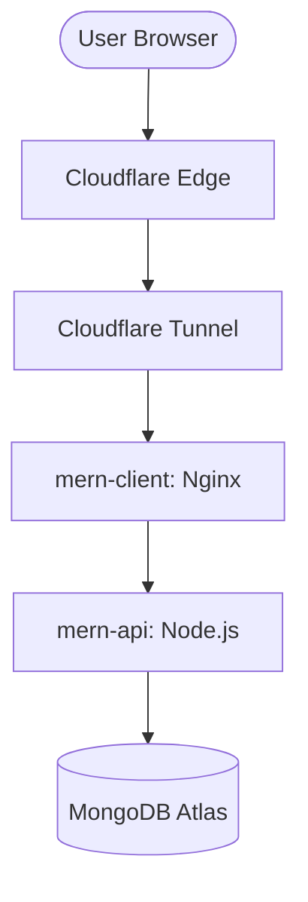

# Modern Blog Deployment Guide (Local Server + Docker + Cloudflare)

This guide will help you deploy the application on your local server using **Docker** and secure it with **Cloudflare Tunnel**.

## Prerequisites
- [Docker](https://docs.docker.com/get-docker/) and [Docker Compose](https://docs.docker.com/compose/install/) installed on your server.
- A [Cloudflare Account](https://dash.cloudflare.com/sign-up).
- A domain name managed by Cloudflare.

---

## 1. Environment Setup

Create a `.env` file in the **root directory** (next to `docker-compose.yml`) of the project:

```env
# REQUIRED:
JWT_SECRET=your_super_secret_key_here

# OPTIONAL:
# MONGO_URI=mongodb+srv://... (Only if NOT using local Docker Mongo)
```

> [!TIP]
> Docker Compose will automatically read this file and pass the variables into the containers.
> By default, the `docker-compose.yml` is configured to use the internal `mongodb` container (`mongodb://mongodb:27017/blog-app`). You only need to provide `JWT_SECRET`.
> Change the backend API URL in your frontend if necessary. However, the current `docker-compose` setup uses an Nginx proxy to route `/api` requests automatically.

---

## 2. Deploy with Docker

Run the following command in the root directory to build and start the containers in detached mode:

```bash
docker-compose up -d --build
```

The application will be accessible at:
- **Frontend**: `http://localhost:80`
- **Backend API**: `http://localhost:5000`

---

## 3. Secure with Cloudflare Tunnel

To expose your local server securely without port forwarding:

1. **Install Cloudflared**:
   Follow the [official guide](https://developers.cloudflare.com/cloudflare-one/connections/connect-networks/get-started-guide/local-management/install-cloudflared/) for your OS.

2. **Login to Cloudflare**:
   ```bash
   cloudflared tunnel login
   ```

3. **Create a Tunnel**:
   ```bash
   cloudflared tunnel create my-blog-tunnel
   ```

4. **Configure Routing**:
   Create a `config.yml` (usually in `~/.cloudflared/`):
   ```yaml
   url: http://localhost:80
   tunnel: <your-tunnel-uuid>
   credentials-file: /path/to/credentials.json

   ingress:
     - hostname: yourblog.yourdomain.com
       service: http://localhost:80
     - service: http_status:404
   ```

5. **Route Domain**:
   ```bash
   cloudflared tunnel route dns my-blog-tunnel yourblog.yourdomain.com
   ```

6. **Run Tunnel**:
   ```bash
   cloudflared tunnel run my-blog-tunnel
   ```

---

## Architecture Overview



- **mern-client**: Serves React frontend and proxies `/api` requests to the backend.
- **mern-api**: Handles core business logic and database interactions.
